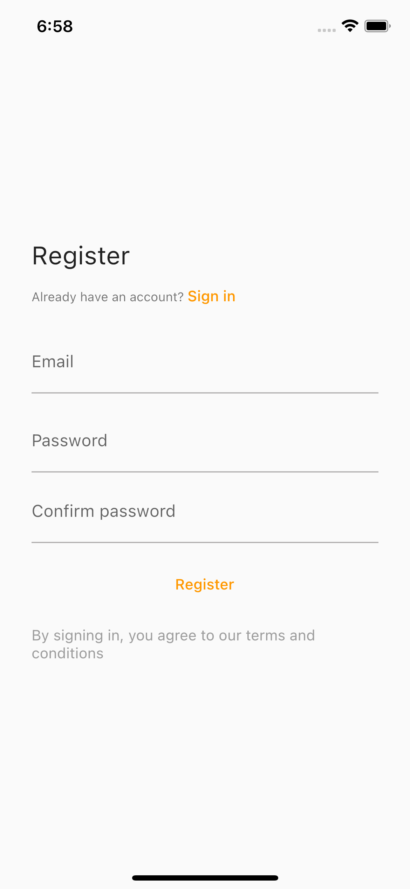

# ecom_admin

Another flutter project where this time I follow the tutorial to create the admin side of an ecom application run from the phone. 

## Tools used

It will use riverpod, firesbase, firestore, firebase auth and some other dependencies to make the app more user friendly. 

## Screenshots

| FlutterFire UI Register | FlutterFire UI Login |
| ----------- | ----------- |
|  |  |

| Admin page with FAB and logout | Product detail page |
| ----------- | ----------- |
|  |  |

| Snackbar complete and item listed page | Snackbar deleted and admin empty page |
| ----------- | ----------- |
|  |  | 